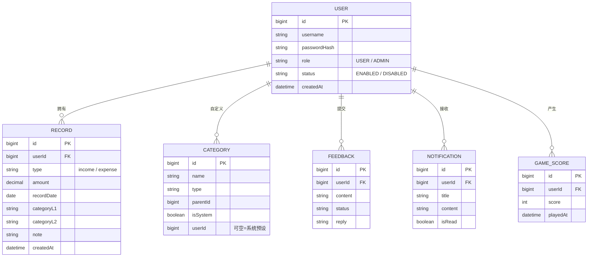

# 林蛮记账 · 多用户联网系统 · 项目计划

> 本文档是项目的「总蓝图」，供后续**分模块开发**时参考。
> 面向非技术读者，所有技术名词都附带大白话解释；遇到需要你决策的地方会标注「⚠️ 待你确认」。
> 最后更新：2026-07-18

---

## 一、我们要做什么（一句话版）

把现在「只能在自己电脑上用的单机记账软件」，升级成「**很多人可以同时在线使用、数据互不干扰、能装在服务器上、手机电脑都能用**」的联网记账系统。

---

## 二、为什么现在要改（背景）

| 现在的样子 | 想要的样子 |
|-----------|-----------|
| 装在自己电脑上的桌面软件 | 打开浏览器 / 手机 App 就能用 |
| 数据库存在本机文件里 | 数据库统一放在服务器上 |
| 只有一个人在用 | 多个用户各自记账、互不看见 |
| 没法给别人用 | 有管理员管用户、发通知、备份数据 |

> 大白话：**从「单机游戏」变成「联网游戏」**，核心改动是加一个「服务器」来统一管理数据和用户。

---

## 三、系统长什么样（架构总览）

```
    ┌─────────────────┐      ┌─────────────────┐
    │  电脑/手机浏览器  │      │   手机 App       │
    │  (网页版)        │      │  (独立应用)      │
    └────────┬────────┘      └────────┬────────┘
             │                        │
             │      都通过网络访问       │
             └───────────┬────────────┘
                         ▼
                 ┌───────────────────┐
                 │  Nginx（门卫/路由） │
                 └─────────┬─────────┘
                           ▼
                 ┌───────────────────┐
                 │  Spring Boot 后端  │  ← 所有业务逻辑都在这里
                 │  （统一接口服务）    │
                 └─────────┬─────────┘
                           ▼
                 ┌───────────────────┐
                 │   MySQL 数据库     │  ← 所有数据统一存放
                 └───────────────────┘
```

**核心思想**：后端（服务器上的程序）只写一份，网页和手机 App 都去「问」它要数据。这就是「前后端分离 + 一套接口服务多端」。

---

## 四、两种角色与功能清单

### 👤 普通用户（所有人注册后默认就是普通用户）
| 功能 | 大白话说明 |
|------|-----------|
| 记账 | 记收入 / 支出，选分类，写备注 |
| 查看明细与概览 | 看本月收支、历史记录列表 |
| 消费报表 | 看「消费趋势折线图」和「各类别占比饼图」 |
| 导出账本 | 把自己的账导出成 Excel / CSV 文件保存 |
| 贪吃蛇游戏 | 网页里内置小游戏，可记录最高分 |
| 提交反馈 | 给系统提意见/建议，帮助系统变好 |
| 接收通知 | 收到管理员发来的公告/私信 |

### 🛡 管理员（由系统创建或升级）
在普通用户全部能力之上，额外拥有：
| 功能 | 大白话说明 |
|------|-----------|
| 用户管理 | 查看所有用户、启用 / 禁用某个账户（禁用后该用户无法登录） |
| 数据库备份 | 一键把数据库导出备份，防止数据丢失 |
| 发送通知 | 给所有用户或指定用户发公告/私信 |
| 查看反馈 | 查看普通用户提交的反馈并可回复 |

> ⚠️ **数据隔离原则**：每个用户的账**只有自己能看**；管理员是「超级用户」，可以看到和管理所有人，但这是管理员特权，普通用户之间互不可见。

---

## 五、技术栈选型（已结合你的选择）

### 后端（你指定：Java 系）
| 技术 | 大白话作用 |
|------|-----------|
| **Java 17 + Spring Boot 3** | 后端主框架，搭起服务器程序的骨架 |
| **Spring Security + JWT** | 管登录、管「谁能干什么」的权限 |
| **Spring Data JPA** | 用 Java 代码操作数据库，不用手写 SQL（对初学者最友好） |
| **MySQL 8** | 数据库（你指定） |
| **Maven** | 自动下载依赖、打包编译的工具 |
| **EasyExcel** | 用来生成 Excel 导出文件 |
| **SpringDoc** | 自动生成接口说明文档（方便调试） |

### 前端（电脑/手机浏览器）
| 技术 | 大白话作用 |
|------|-----------|
| **React + TypeScript** | 网页界面（沿用现有项目，不用重学） |
| **Ant Design 5** | 现成的漂亮组件库（按钮、表格、卡片等） |
| **响应式适配** | 电脑宽屏和手机窄屏自动切换布局 |
| **React Router** | 页面之间跳转 |
| **Axios** | 前端去「问」后端要数据 |
| **图表库（ECharts）** | 画趋势折线图、占比饼图 |

### 手机 App（独立应用）
| 技术 | 大白话作用 |
|------|-----------|
| **React Native（Expo）** | 用和网页一样的语言做手机 App，安卓/iOS 都能装 |

### 部署
| 技术 | 大白话作用 |
|------|-----------|
| **Docker** | 把后端和数据库打包成「集装箱」，到哪台服务器都能一样运行 |
| **docker-compose** | 一条命令同时启动「数据库 + 后端」 |
| **.env 配置文件** | 把密码、密钥等敏感信息集中放好，不写进代码 |

---

## 六、数据存在哪（数据库表设计）

每张「业务表」都带一个 `user_id`（用户编号），用来区分是谁的数据。

| 表名 | 存什么 | 关键字段 |
|------|--------|---------|
| **user（用户）** | 账号信息 | id、用户名、密码（加密后）、角色(普通/管理员)、状态(启用/禁用) |
| **record（账目）** | 每一笔收支 | id、**user_id**、类型(收入/支出)、金额、日期、一级分类、二级分类、备注 |
| **category（分类）** | 消费分类 | id、名称、类型、父级、是否系统预设、user_id(可空) |
| **feedback（反馈）** | 用户意见 | id、**user_id**、内容、处理状态、回复 |
| **notification（通知）** | 管理员消息 | id、**user_id**、标题、内容、是否已读 |
| **game_score（游戏分数）** | 贪吃蛇成绩 | id、**user_id**、分数、游玩时间 |

> 说明：现有单机版 `records` 表的字段（type/amount/date/category_l1/category_l2/note）全部保留，只是新增 `user_id` 来区分用户。

### 6.1 怎么区分普通用户和管理员（重要）

**不建两张表，而是同一张 `user` 表里用一个「角色标签」字段区分：**

| 字段 | 含义 | 取值 |
|------|------|------|
| `role` | 角色标签 | `USER`（普通用户）或 `ADMIN`（管理员） |
| `status` | 账户状态 | `ENABLED`（启用）或 `DISABLED`（禁用） |

- 管理员**本质也是一条 user 记录**，只是 `role = ADMIN`；因此管理员天然拥有普通用户的全部能力。
- 管理员专属功能（禁用账户、备份、发通知）由后端加权限锁：只有 `role=ADMIN` 才放行，普通用户调用会被拒绝。
- `status = DISABLED` 表示被管理员「停用」，该用户登录会被拦截。
- **数据隔离**靠 `user_id`：查账时只返回 `user_id = 当前登录用户` 的记录，管理员接口才允许跨用户查询。

### 6.2 E-R 图（实体关系）

关系均为「一个用户对应多条记录」的一对多（1∶N）：



> 说明：每条业务表都带 `userId` 外键指向 `USER.id`；`CATEGORY` 的 `userId` 可为空，表示系统内置的通用分类。

---

## 七、安全要点（很重要）

- **密码绝不存明文**：用 BCrypt 加密后存储，即使数据库泄露也看不到真实密码。
- **JWT 登录凭证**：登录后发一个「临时通行证」Token，每次请求带上，服务器据此知道你是谁、能不能干这件事。
- **数据过滤在服务器做**：不是前端说「只看我的」就只看我的，而是服务器强制按登录用户过滤，防止有人改代码偷看别人的账。
- **管理员接口加锁**：所有管理员操作都强制校验「你必须是管理员」，否则拒绝。
- **数据库备份只许用预定义命令**：管理员备份走固定的安全命令，绝不开通「随便执行 SQL」的危险功能。

---

## 八、分模块开发路线图（后续就按这个来）

> 每个模块独立开发、独立测试，完成一个再下一个。模块编号 M0~M7。

| 模块 | 名称 | 做什么 | 对应角色 |
|------|------|--------|---------|
| **M0** | 基础设施 | 搭好 Spring Boot 空壳、写好 MySQL 建表脚本、配置连接**本地 MySQL** | 全部 |
| **M1** | 用户与鉴权 | 注册、登录、JWT、角色、管理员启用/禁用账户 | 全部 + 管理员 |
| **M2** | 记账核心 | 收支记录增删改查、分类管理、网页端接上后端 | 普通用户 |
| **M3** | 报表与导出 | 消费趋势图、类别占比图、导出 Excel | 普通用户 |
| **M4** | 反馈与通知 | 用户提反馈、管理员发通知、通知中心 | 全部 + 管理员 |
| **M5** | 贪吃蛇游戏 | 网页内嵌游戏并保存最高分 | 普通用户 |
| **M6** | 手机 App | 用 React Native 做手机版，功能对齐网页 | 全部 |
| **M7** | Docker 部署 | 用 docker-compose 创建 MySQL 容器 + 后端镜像，编排并部署到服务器 | 运维 |

### 关于「什么时候用 Docker」的重要澄清

- **开发阶段（M0~M6）不使用 Docker**：后端直接连接你电脑上**现有的本地 MySQL**（即你已运行的 3306 容器），在其中新建一个**独立数据库 `linman_account`**。因为库名不同，与你的其它项目数据完全隔离、互不冲突，无需新开容器、也无需现在学 Docker。
- **部署阶段（M7）才引入 Docker**：功能全部做完后，再用 `docker-compose` 创建专用的 MySQL 容器（可映射到 3307 端口避免与你本地 3306 冲突）和后端镜像，打包部署到服务器。
- **开发环境与生产环境一致性**：两者都使用 MySQL 8，版本一致即可避免差异问题。

**建议开发顺序**：M0 → M1 → M2 → M3 → M4 → M5 → M6 → M7

> 我们已经完成的「现有项目」包含：记账页面、分类管理、贪吃蛇页面（单机版）。重构时这些界面逻辑会**保留**，只是把「读本地文件」改成「问服务器」。

---

## 九、目标目录结构（改造后）

```
account_book/
├── PROJECT_PLAN.md          # 本计划文档
├── backend/                 # Spring Boot 后端（新增）
│   ├── pom.xml              # Maven 依赖配置
│   ├── Dockerfile           # 后端打包成 Docker 镜像
│   └── src/main/...         # Java 代码（controller/service/entity 等）
├── web/                     # React 网页前端（由现有 src 改造）
│   ├── src/api/             # 调用后端接口的封装（替代原 db.ts）
│   ├── src/pages/           # 现有页面改为消费接口
│   └── src/admin/           # 管理员后台页面（新增）
├── mobile/                  # React Native 手机 App（新增）
├── docker-compose.yml       # 编排 MySQL + 后端（新增）
└── docs/                    # 部署与分模块说明（新增）
```

---

## 十、给非技术读者的「开发须知」

1. **每次只做一个模块**，做完测好再做下一个，别一口气全写。
2. 后端是「大脑」，前端和 App 是「手脚」——先有大脑（M0/M1），手脚才能动。
3. **数据库密码、JWT 密钥**等敏感信息放进 `.env` 文件，**不要**写进代码里、也不要提交到 Git。
4. 遇到问题先看后端控制台的报错日志，再问 AI 帮手。
5. 每个模块完成后用 Git 提交一次（像之前那样 `/compact` 后 `git commit`），保持进度可追溯。

---

## 十一、⚠️ 待你后续确认 / 补充的信息

- **服务器从哪来**：是自己买云服务器（阿里云/腾讯云），还是先用自己电脑跑着测试？（影响 M7 部署细节）
- **管理员怎么产生**：是由系统初始化时自动创建一个管理员账号，还是你手动在数据库里加？（影响 M1）
- **注册是否开放**：普通用户能否自己注册，还是需要管理员邀请/审核？（影响 M1）
- **通知形式**：只做「站内信」（App/网页里看），还是也要接短信/邮件？（影响 M4 工作量）
- **游戏成绩是否要排行榜**：贪吃蛇要不要做「所有用户分数排名」？（影响 M5）

> 以上问题不影响现在开始 M0/M1，可在对应模块开发前再定。你随时可以补充想法，我会更新本计划。
